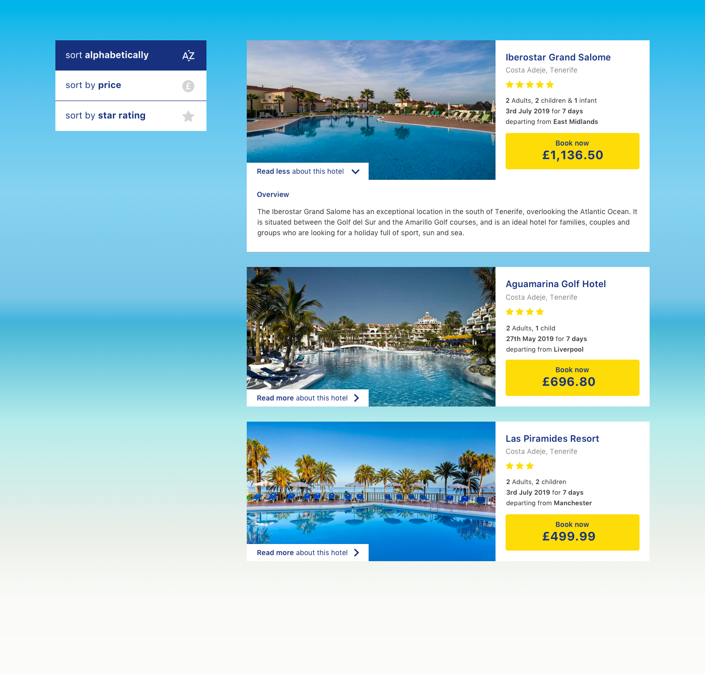

# On The Beach Take Home Task

This is a take home task created when apply to a frontend position at On The Beach.

## The task

Produce a HTML, CSS and JavaScript representation of the given `design.png` with the following features:

- Sort the results by price (this should be the default)
- Sort the results by star rating and highlight when active
- Sort the results alphabetically by hotel name and highlight when active
- Ability to toggle expanded hotel description

We are looking for a client side solution, there should be no server logic involved.

Feel free to use JavaScript libraries or frameworks. Imagine this will be a component added to a large website.

You may use things like CSS Preprocessors and JavaScript build tools, but if you do please include the dependencies/source files.
Feel free to source your own icons.

Things we like:

- Semantic HTML
- Modular CSS
- Error/warning free JavaScript
- Clean flow of state throughout the application

## Running the Project

This project was bootstrapped with [Create React App](https://github.com/facebook/create-react-app).

### Available Scripts

In the project directory, you can run:

### `npm start`

Runs the app in the development mode.\
Open [http://localhost:3000](http://localhost:3000) to view it in your browser.

The page will reload when you make changes.\
You may also see any lint errors in the console.

### `npm test`

Launches the test runner in the interactive watch mode.

You can learn more in the [Create React App documentation](https://facebook.github.io/create-react-app/docs/getting-started).
